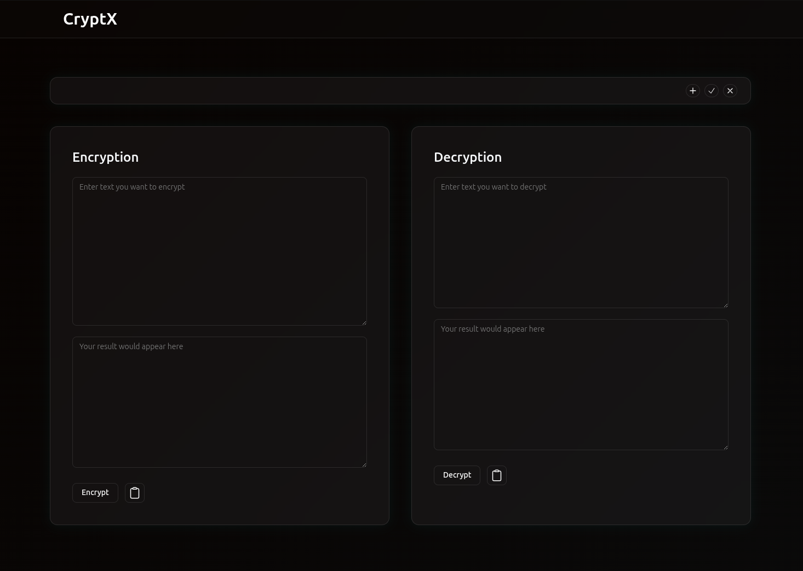

#  Text Encryption & Transformation Web App

A modern **React + Tailwind CSS** web application for performing text encryption, decryption, and transformations with support for multiple operations like **AES encryption**, **Base64 encoding/decoding**, and more.  
The app features a clean UI, dynamic input handling, and real-time transformations.

---

##  Features

- 🔑 **AES Encryption & Decryption** – Securely encrypt and decrypt text.
- 🧩 **Base64 Encoding & Decoding** – Encode/Decode strings instantly.
- 🔄 **Chained Transformations** – Apply multiple operations in sequence via dynamic dropdowns.
- 📝 **Live Input Handling** – Results update dynamically as you type.
- 📋 **One-click Copy** – Copy results to clipboard with a button.

---

## 🖼️ Preview

  

---

## 🚀 Tech Stack

- **Frontend:** [React](https://reactjs.org/) (Vite/CRA)  
- **Styling:** [Tailwind CSS](https://tailwindcss.com/)  
- **State Management:** [Recoil](https://recoiljs.org/)  
- **UI Components:** Custom + ShadCN patterns  

---

## 📦 Installation

Clone the repository and install dependencies:

```bash
# Clone repo
git clone https://github.com/sonxmS/CryptX.git
cd CryptX

npm install

# Start development server
npm run dev

